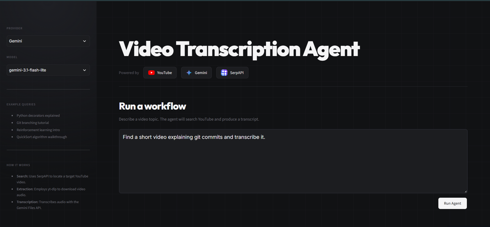
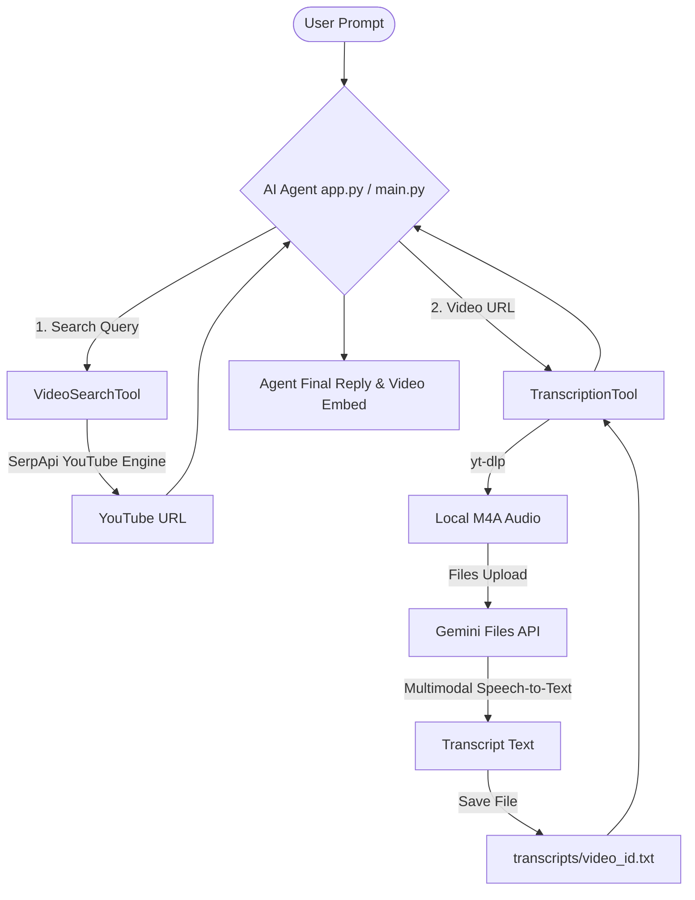

# 🎬 AI Agent with Video Search + Transcription

[](https://www.python.org/)
[](https://streamlit.io/)
[](https://ai.google.dev/)
[](https://serpapi.com/)

A practice-based AI Agent project implementing multi-tool calling. The agent utilizes **SerpApi** to search YouTube for videos, and a **Google Gemini Multimodal** transcription tool to extract and store speech-to-text transcripts locally. 


Features a beautiful interactive Streamlit local web interface alongside a Python Command Line Interface.

---

## 🛠️ Architecture



---

## ✨ Features

- **Multi-Tool Calling**: Seamless integration where the agent autonomously queries SerpApi for search, retrieves YouTube links, then passes the URL to download and transcribe.
- **Robust Model Fallbacks**: Automatically falls back sequentially through `gemini-3.5-flash` ➡️ `gemini-3.5-flash-lite` ➡️ `gemini-3.1-flash-lite` to ensure 100% execution compatibility.
- **Sleek Web GUI**: A modular dark-themed Streamlit web interface with status tracking, real-time agent output, embedded video player, and formatted transcript downloads.
- **Command Line Power**: CLI client (`main.py`) supporting automatic agent providers (both Gemini and Groq).
- **Safe Resource Cleanup**: Systematically deletes temporary downloaded audio tracks locally and remote Gemini cloud storage assets after completion.

---

## 🚀 Setup & Installation

### Prerequisite
Make sure you have [uv](https://github.com/astral-sh/uv) installed.

### 1. Clone the project and sync dependencies
Simply run code sync in your project directory:
```bash
# Sync packages (google-genai, requests, yt-dlp, streamlit, python-dotenv, groq)
uv sync
```

### 2. Configure Environment Variables
Create a `.env` file in the root directory (already gitignored) and insert your credentials:
```env
SERPAPI_API_KEY="your_serpapi_private_key"
GEMINI_API_KEY="your_gemini_api_key"

# Optional: Configuration if using Groq as agent backend
GROQ_API_KEY="your_groq_api_key"
```

---

## 🖥️ Running the Application

### Option A: Local Web Server (Streamlit Host)
Launch the interactive web portal locally on `http://localhost:8501`:
```bash
uv run streamlit run app.py
```

### Option B: Command Line Interface
Execute direct commands through the python CLI agent:
```bash
# Run with default query (auto-selects engine based on keys)
uv run python main.py

# Specify customized prompt / provider
uv run python main.py "Search video about recursion in python and transcribe it" --provider gemini
```

---

## 🧪 Testing and Verification
Unit tests are implemented to verify the agent's multi-step decision control loop using mock frameworks (so tests run successfully without consuming actual API token quotas).
Run tests:
```bash
uv run python test_agent.py
```


<!-- Final verification patch -->
